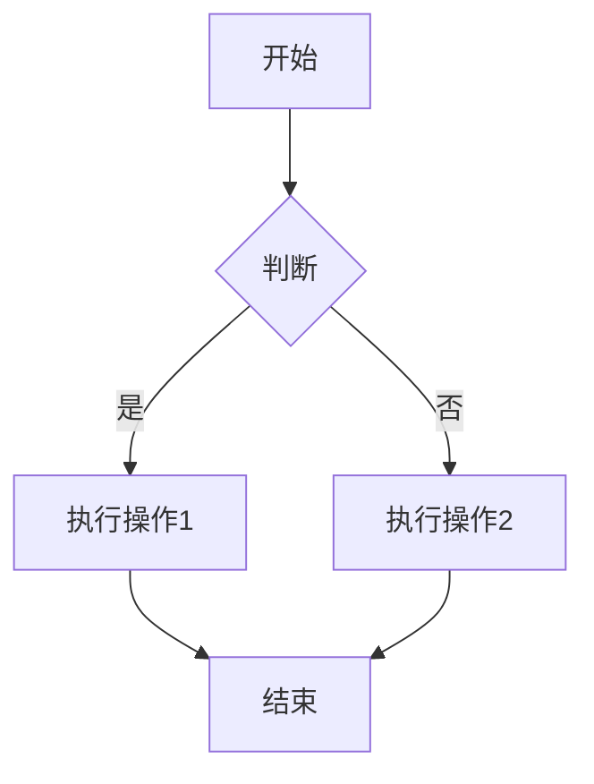

# Markdown Preview Extension

一个VSCode扩展，允许您在浏览器中预览Markdown文件，支持完整的Markdown语法、代码高亮、Mermaid图表和表格。

## 功能特性

- ✅ **完整的Markdown支持** - 支持所有标准Markdown语法
- ✅ **代码高亮** - 使用Highlight.js为代码块提供语法高亮
- ✅ **Mermaid图表** - 支持Mermaid流程图、时序图、甘特图等
- ✅ **表格支持** - 完美渲染Markdown表格
- ✅ **右键菜单** - 在文件资源管理器和编辑器中右键点击.md文件即可预览
- ✅ **多预览隔离** - 每个预览都有独立的URL，互不干扰
- ✅ **自动清理** - 自动清理长时间未访问的预览会话

## 安装

1. 克隆或下载此扩展
2. 在扩展目录运行 `npm install` 安装依赖
3. 运行 `npm run compile` 编译TypeScript代码
4. 在VSCode中按 `F5` 打开扩展开发宿主窗口进行测试
5. 或者使用 `vsce package` 打包扩展并安装

## 使用方法

### 方法1：右键菜单

1. 在VSCode中打开一个`.md`文件
2. 右键点击文件（在资源管理器或编辑器中）
3. 选择 **"Preview Markdown in Browser"**
4. 浏览器会自动打开并显示渲染后的HTML

### 方法2：命令面板

1. 打开一个`.md`文件
2. 按 `Ctrl+Shift+P` (Windows/Linux) 或 `Cmd+Shift+P` (Mac) 打开命令面板
3. 输入 "Preview Markdown in Browser"
4. 选择该命令

## 支持的Markdown特性

### 基础语法
- 标题（H1-H6）
- 段落和换行
- 粗体和斜体
- 链接和图片
- 列表（有序和无序）
- 引用块
- 水平线

### 代码块
支持多种编程语言的语法高亮，例如：
- JavaScript/TypeScript
- Python
- Java
- C/C++
- Go
- Rust
- 等等...

### Mermaid图表

支持以下Mermaid图表类型：



### 表格

| 功能 | 支持 | 说明 |
|------|------|------|
| 基础表格 | ✅ | 标准Markdown表格 |
| 对齐 | ✅ | 左对齐、居中、右对齐 |
| 复杂表格 | ✅ | 多行多列表格 |

## 技术架构

### 单例HTTP服务器
- 整个扩展生命周期内只有一个HTTP服务器实例
- 默认监听端口3000，如果被占用则自动查找可用端口
- 所有预览请求共享同一个服务器实例

### 预览会话隔离
- 每个预览生成唯一的预览ID（基于文件路径hash + 时间戳）
- URL格式：`http://localhost:{port}/preview/{previewId}`
- HTML内容存储在服务器内存中，不创建临时文件
- 每个预览都有独立的URL，互不干扰

### 自动清理机制
- 定期清理超过30分钟未访问的预览会话
- 限制最大会话数为50个，超出时清理最旧的会话
- 扩展停用时清理所有会话

## 开发

### 项目结构

```
markdown-preview-ext/
├── package.json              # 扩展配置和依赖
├── tsconfig.json            # TypeScript配置
├── .vscodeignore           # 发布时忽略的文件
├── src/
│   ├── extension.ts        # 扩展主入口
│   ├── markdownRenderer.ts # Markdown渲染逻辑
│   └── server.ts           # HTTP服务器
├── media/
│   └── preview.html        # HTML模板
└── README.md               # 扩展文档
```

### 构建

```bash
# 安装依赖
npm install

# 编译TypeScript
npm run compile

# 监听模式编译
npm run watch
```

### 调试

1. 在VSCode中打开此项目
2. 按 `F5` 启动扩展开发宿主窗口
3. 在新窗口中测试扩展功能

## 依赖

- `markdown-it` - Markdown解析器
- `markdown-it-mermaid` - Mermaid图表支持
- `highlight.js` - 代码高亮
- `@types/vscode` - VSCode API类型定义
- `@types/node` - Node.js类型定义

## 许可证

MIT License

## 作者

kejiqing

## 贡献

欢迎提交Issue和Pull Request！
